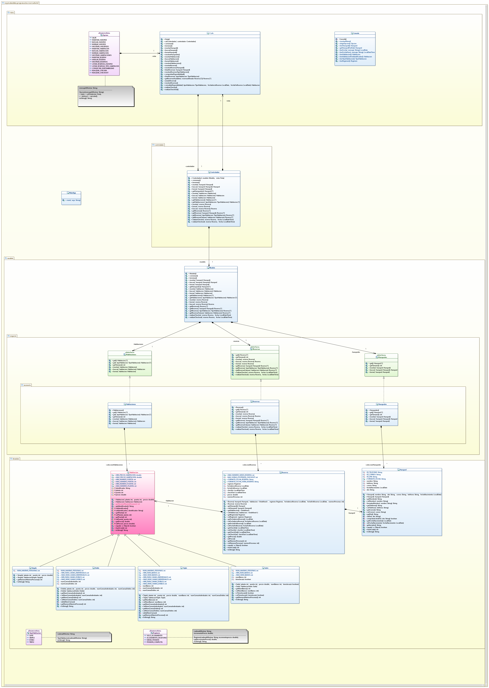

# Tarea: Reservas Hotel_v3
## Profesor: Andrés Rubio del Río
## Alumno:Elisa López Abad

En este tercer spring de la tarea deberás modelar la gestión de las reservas del hotel IES Al-Ándalus, eliminando la restricción de tamaño en los datos de la aplicación. Por lo que decidimos utilizar estructuras dinámicas de datos, en concreto Listas.

Para las diferentes clases del modelo que contienen las colecciones de objetos del dominio (las que están incluidas en el paquete negocio) deberemos sustituir los Array por ArrayList y, cómo no, ajustar los diferentes métodos para que sigan haciendo lo mismo que antes, pero utilizando las nuevas estructuras de datos. Como observarás, muchos de los métodos privados que teníamos antes desaparecen ya que ahora no serán necesarios.

Por otro lado, dado el buen hacer en la segunda entrega, el cliente ha decidido que se añada la ordenación de los datos a la hora de listarlos en la vista para tener un mejor control y organización. En este caso deberás modificar los correspondientes métodos de mostrar y listar para que los resultados aparezcan ordenados de la siguiente manera:

El listado de Huéspedes (método mostrarHuespedes) deberá mostrarse ordenado alfabéticamente de la A a la Z por el nombre.
El listado de Habitaciones (método mostrarHabitaciones) deberá mostrarse ordenado, primero por planta y segundo por puerta, en orden ascendente.
El listado de Reservas de un Huésped o de una habitación determinados (métodos listarReservas) deberá mostrarse ordenado por la fecha de inicio de la reserva en orden descendente (de las más recientes, a las más antiguas). En el caso de que existan diferentes reservas en la misma fecha, se aplicará una segunda ordenación dependiendo del tipo de listado:
Si el listado se hace por Huésped, se ordenarán las reservas con la misma fecha de inicio, por numero de planta y puerta en orden ascendente.
Si el listado se hace por Habitación, se ordenarán las reservas con la misma fecha de inicio, por el nombre del huésped en orden alfabético de la A a la Z.
En el listado de Reservas general (método mostrarReservas), éstas se mostrarán ordenadas por la fecha de inicio en orden descendente (de las más recientes, a las más antiguas). En caso de que existan varias reservas en la misma fecha, se realizará una segunda ordenación por la habitación en orden ascendente, teniendo en cuenta primero el número de planta y segundo el número de puerta.
Para todo esto, a continuación te muestro como queda el diagrama de clases con las modificaciones y poco a poco te iré explicando los diferentes pasos a realizar:

## Diagrama de Clases

## Primeros Pasos

Realiza un fork del repositorio de tu tarea anterior en otro nuevo llamado ReservasHotel_v3. Dicho repositorio lo clonarás localmente y realizarás las diferentes modificaciones que se piden en esta tarea.
Modifica tu fichero README.
Realiza tu primer commit.
Habitaciones C.E. 6B

Modifica la clase Habitaciones para que utilice un ArrayList en vez de un Array.
Elimina aquellos atributos y métodos que ya no sean necesarios, al utilizar esta nueva estructura.
Realiza el commit correspondiente.
Reservas C.E. 6B

Modifica la clase Reservas para que utilice un ArrayList en vez de un Array.
Elimina aquellos atributos y métodos que ya no sean necesarios, al utilizar esta nueva estructura.
Realiza un commit con la modificación de este enumerado.
Huespedes C.E. 6B

Modifica la clase Huespedes para que utilice un ArrayList en vez de un Array.
Elimina aquellos atributos y métodos que ya no sean necesarios, al utilizar esta nueva estructura.
Realiza el commit correspondiente.
Modelo C.E. 6B

Elimina la constante CAPACIDAD, puesto que ya no tienes limitaciones de memoria.
Realiza un commit con la nueva clase creada.
Vista C.E. 6B y 6D

Modifica el método mostrarHuespedes para que aplique la ordenación descrita anteriormente.
Modifica el método mostrarHabitaciones para que aplique la ordenación descrita anteriormente.
Modifica los métodos listarReservas para que aplique la ordenación descrita anteriormente.
Modifica el método mostrarReservas para que aplique la ordenación descrita anteriormente.
Realiza un commit con la nueva clase creada.
Se valorará:

La indentación debe ser correcta en cada uno de los apartados.
El nombre de las variables debe ser adecuado.
Se debe utilizar la clase Entrada para realizar la entrada por teclado.
El programa debe pasar todas las pruebas que van en el esqueleto del proyecto y toda entrada del programa será validada, para evitar que el programa termine abruptamente debido a una excepción.
La corrección ortográfica tanto en los comentarios como en los mensajes que se muestren al usuario.